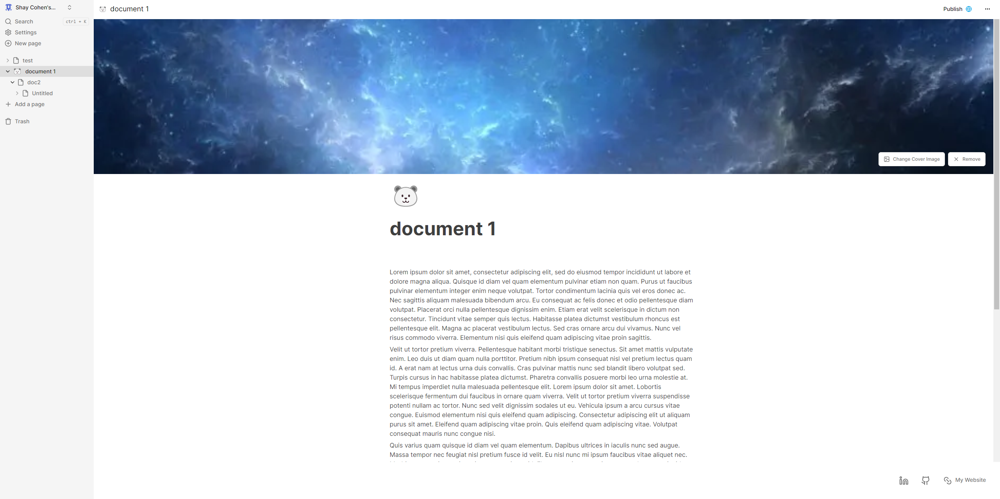

# This is my Document managment app

This is a documentation management app built with Next.js and deployed on vercel.<br>
The purpose of this website is to create documents/notes/lists with a detailed editor, image upload,
customizable file icons, creating child documents and an abilty to share your documents with others.<hr>

## <a href="https://documents-app-kappa.vercel.app/">LIVE WEBSITE</a>

## Key features:

• Create an account, sign in using google and github<br>
• Create, archiving and deleting documents <br>
• Detailed editor and image upload to the body of the document <br>
• Upload a cover image for the document <br>
• Change the document's icon <br>
• Create child documents <br>
• Search using ctrl+K <br>
• Publish the document

## Technologies used:

<details>
<summary>Read more...</summary>

### • Database

• <a href="https://www.convex.dev/">convex.dev</a> - Real time database / backend application platform.

<details>
<summary>How it works?</summary> <br>
• Install convex

```
npm install convex
```

• Run convex

```
npx convex dev
```

• In the convex folder define the schema in schema.ts like this:

```ts
import { defineSchema, defineTable } from "convex/server";
import { v } from "convex/values";

export default defineSchema({
  documents: defineTable({
    title: v.string(),
    userId: v.string(),
    isArchived: v.boolean(),
    parentDocument: v.optional(v.id("documents")),
    content: v.optional(v.string()),
    coverImage: v.optional(v.string()),
    icon: v.optional(v.string()),
    isPublished: v.optional(v.boolean()),
    hasActiveChildren: v.boolean(),
  })
    .index("by_user", ["userId"])
    .index("by_user_parent", ["userId", "parentDocument"]),
});
```

And thats it, you define the queries and mutations in documents.ts

<hr>
</details>

• <a href="https://edgestore.dev/">edgestore</a> - database for file storage, made for next.js

<details>
<summary>How it works?</summary>
• After you create a project install the required packages

```
npm install @edgestore/server @edgestore/react zod
```

• Put your keys in the .env file

```
EDGE_STORE_ACCESS_KEY=your-access-key
EDGE_STORE_SECRET_KEY=your-secret-key
```

• Create the bucket in route.ts in the app folder like this<br>

```
.\app\api\edgestore\`[...edgestore`]\route.ts
```

```ts
import { initEdgeStore } from "@edgestore/server";
import { createEdgeStoreNextHandler } from "@edgestore/server/adapters/next/app";

const es = initEdgeStore.create();

/**
 * This is the main router for the Edge Store buckets.
 */
const edgeStoreRouter = es.router({
  publicFiles: es.fileBucket().beforeDelete(() => {
    return true;
  }),
});

const handler = createEdgeStoreNextHandler({
  router: edgeStoreRouter,
});

export { handler as GET, handler as POST };

/**
 * This type is used to create the type-safe client for the frontend.
 */
export type EdgeStoreRouter = typeof edgeStoreRouter;
```

• Then in

```
./lib/edgestore.ts
```

we initialize the context provider like this:

```ts
"use client";

import { type EdgeStoreRouter } from "../app/api/edgestore/[...edgestore]/route";
import { createEdgeStoreProvider } from "@edgestore/react";

const { EdgeStoreProvider, useEdgeStore } =
  createEdgeStoreProvider<EdgeStoreRouter>();

export { EdgeStoreProvider, useEdgeStore };
```

• Finally wrap the application with the EdgeStoreProvider in

```
./app/layout.ts
```

```ts
return (
  <html lang="en" suppressHydrationWarning>
    <body className={inter.className}>
      <ConvexClientProvider>
        <EdgeStoreProvider>
          <ThemeProvider
            attribute="class"
            defaultTheme="system"
            enableSystem
            disableTransitionOnChange
            storageKey="notes-theme-2">
            <Toaster position="bottom-center" />
            <ModalProvider />
            {children}
          </ThemeProvider>
        </EdgeStoreProvider>
      </ConvexClientProvider>
    </body>
  </html>
);
```

</details>
<hr>

### • Frontend

• <a href="https://nextjs.org/">Next.js</a> - Full stack react framework with server-side rendering, I used it with Typescript.<hr>

### • Design

• <a href="https://tailwindcss.com/">Tailwindcss</a> - a utility based css framework, one advantage for it is that it comes built in when initializing a next.js application.<br>
• <a href="https://ui.shadcn.com/">shadcn/ui</a> - a collection of components built with tailwind and Radix UI, unlike other component libraries its very easy to edit the source code of each component and you can install just the components you need. <hr>

### • Authentication

• <a href="https://clerk.com/">Clerk</a> - User management framework with an easy integration to authentication using third party providers such as login using google github or facebook. <hr>

### • Deployment
• <a href="https://vercel.com/">Vercel</a> - Cloud service especially for frontend applications.
</details>

## Images of the project
<details>
<summary>Click here to view</summary>

### Light-mode
can be changed in the settings


### Editor: 
 
 

### Image upload


### Trash 


### Search 


### publish


</details>
